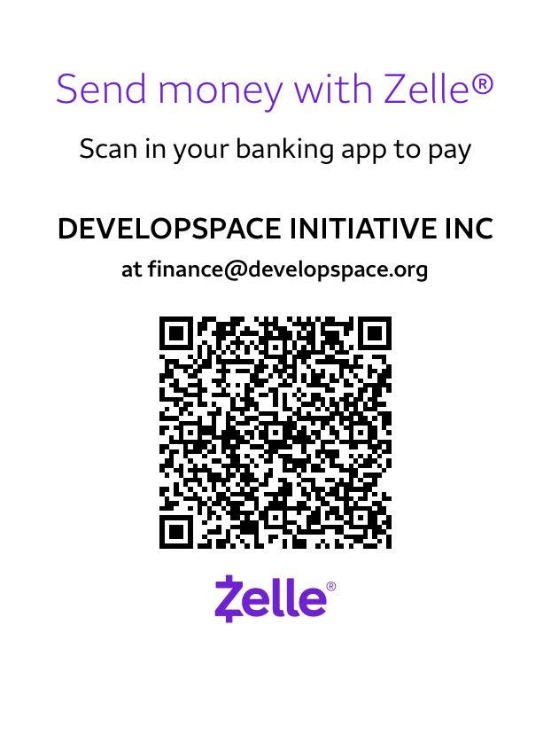

Zelle allows for fast, no-cost transfers to DevelopSpace from accounts at many US banks
and credit unions, saving fees relative to most other online donation options.
Note that Zelle does not provide us with contact information of donors,
so please [email us](mailto:finance@developspace.org) so that we can provide a donation receipt.

You can pick one of the methods below to transfer funds:

* Use your banking app or bank website to send funds via Zelle to **finance@developspace.org**

* Scan this QR code in your mobile banking app (support varies by bank)

Return to main [donation page](/donate).
